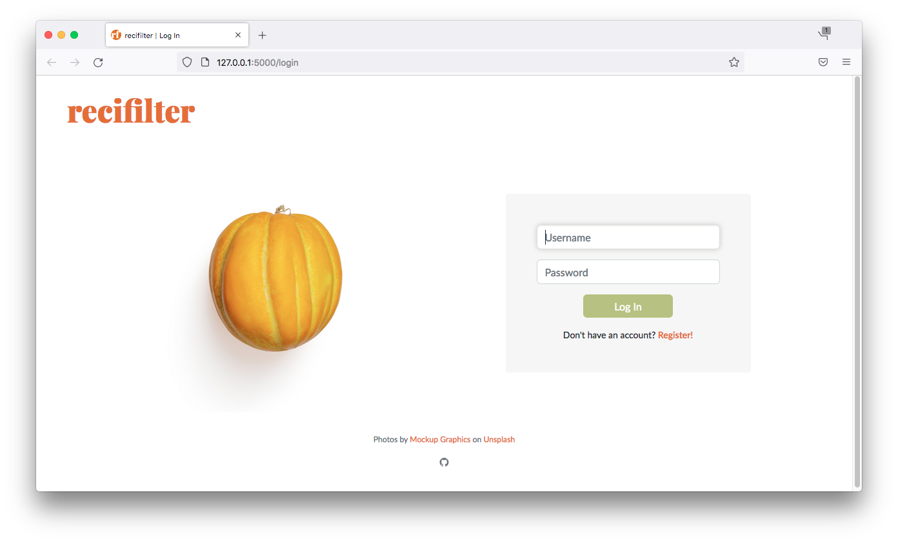
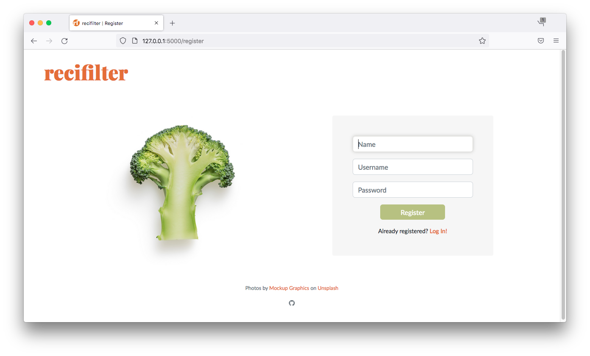
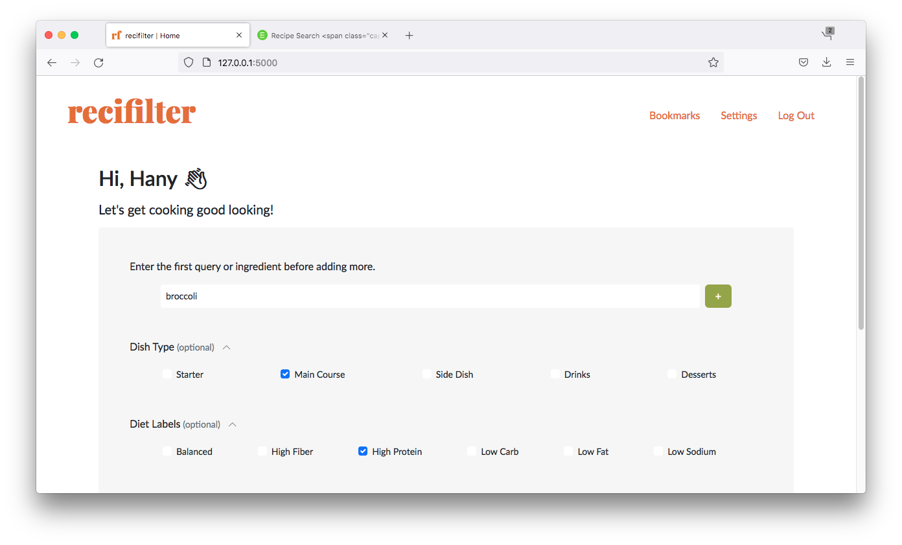
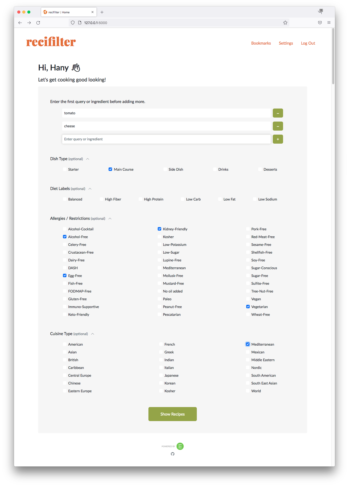
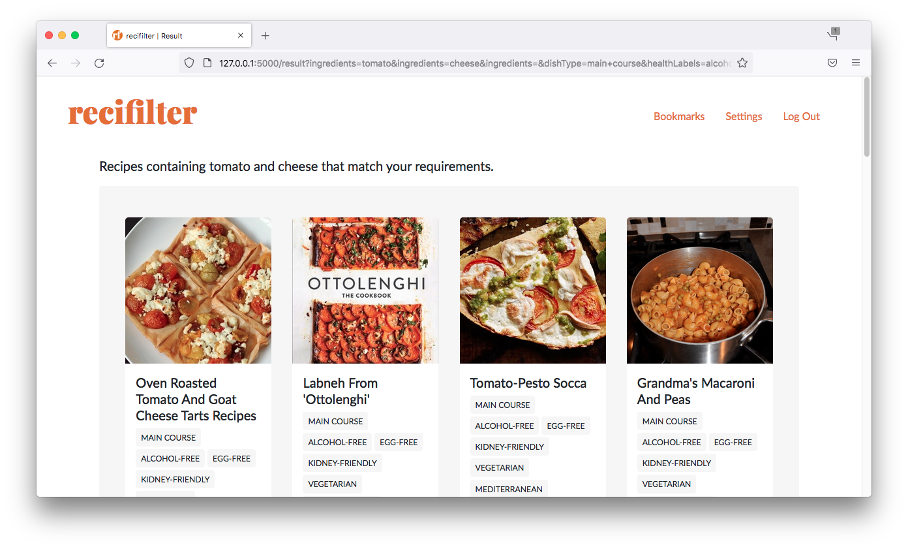
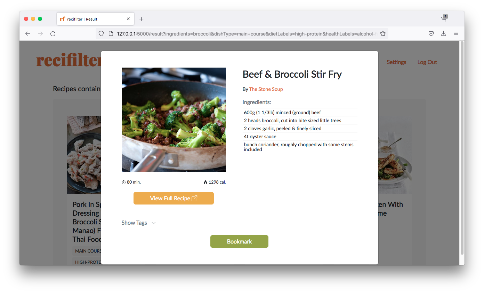
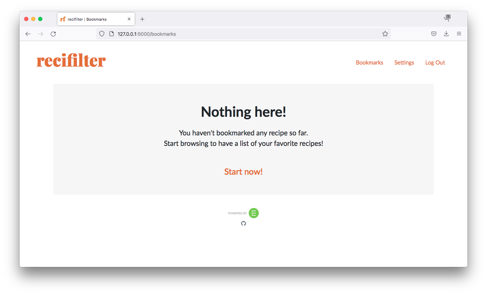
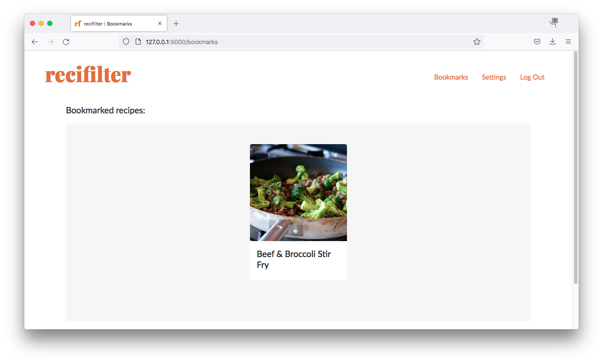
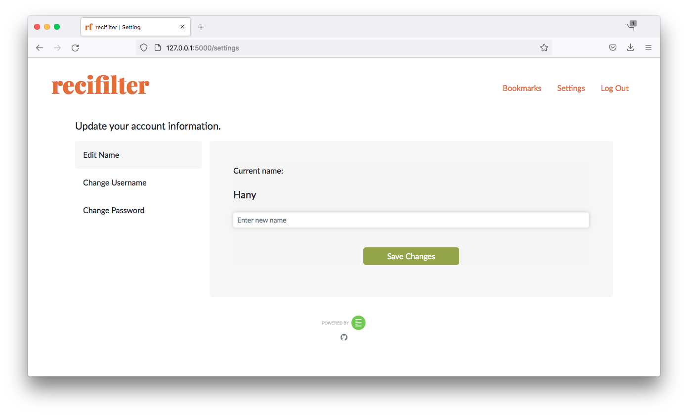

### [Video Demo](https://youtu.be/pKWqBQl-LmM)

### Description: A recipe-filtering web application that lets users, with or without complex dietary need, find and bookmark recipes from the internet with the help from [Edamam's Recipe Search API](https://developer.edamam.com/edamam-recipe-api).

# Deployment

TBA

# Technologies

- Flask
- Python
- SQLite
- Javascript
- jQuery
- HTML
- CSS
- Bootstrap 5

# Installation

- Clone / fork this repository.
- Create a virtual environment in your local Recifilter directory.
- Install the required libraries that are listed in [requirements.txt](/requirements.txt).
- Sign up to [Edamam's Recipe Search API](https://developer.edamam.com/edamam-recipe-api) to get your own API_ID and API_KEY.
- Save your API_ID and API_KEY somewhere you can easily copy and paste in a format like this (replace 123456789 with your API_KEY and API_ID):

```
export API_KEY=123456789
export API_ID=123456789
```

- Copy and paste your API_KEY and API_ID to terminal:

```
$ export API_KEY=123456789
$ export API_ID=123456789
```

- Run the application:

```
$ python3 app.py
```

# Features

## Login / Register



Users have to create an account prior to using this application. Validation is implemented in both front end and back end. Users have to provide a name (which will be used to greet users in the index page), a minimum of four-alphanumeric-characters username that will be used to identify which user has logged in, and a password. The password stored in the database is hashed first, but for safety measures, **PLEASE DO NOT USE YOUR ACTUAL PASSWORD!**

## Index Page



Users can find recipes by keywords in the text field, by checklists, or a combination of both. Input will be sent to back end via get request since we're only using it to retrieve a JSON data from the API.

- ### Text Field

The index page consists of a single text field that can be added or removed dynamically with javascript [(tutorial can be found here)](https://youtu.be/Zu_fu6vxevw). Empty value in the text field is handled in the back end e.g. if users added four text field but only typed in two, the back end will recognize it as two keywords instead of four and the headline in the result page will only show these two keywords.
User can also use the text field as it is, but a comma separated keywords is expected for this method.

- ### Checklists

There are four categories available. Description of each label is taken from [https://developer.edamam.com/edamam-docs-recipe-api](https://developer.edamam.com/edamam-docs-recipe-api):

1. #### Dish Type

   - Starter
   - Main Course
   - Side Dish
   - Drinks
   - Desserts

2. #### Diet Labels

   - Balanced: Protein/Fat/Carb values in 15/35/50 ratio.
   - High Fiber: More than 5g fiber per serving.
   - High Protein: More than 50% of total calories from proteins.
   - Low Carb: Less than 20% of total calories from carbs.
   - Low Fat: Less than 15% of total calories from fat.
   - Low Sodium: Less than 140mg Na per serving.

3. #### Allergies / Restrictions

   - Alcohol-Cocktail: Describes an alcoholic cocktail.
   - Alcohol-Free: No alcohol used or contained.
   - Celery-Free: Does not contain celery or derivatives.
   - Crustacean-Free: Does not contain crustaceans (shrimp, lobster etc.) or derivatives.
   - Dairy-Free: No dairy; no lactose.
   - DASH: Dietary Approaches to Stop Hypertension diet.
   - Egg-Free: No eggs or products containing eggs.
   - Fish-Free: No fish or fish derivatives.
   - FODMAP-Free: Does not contain [FODMAP](https://www.google.com/search?q=FODMAP) foods.
   - Gluten-Free: No ingredients containing gluten.
   - Immuno-Supportive: Recipes which fit a science-based approach to eating to strengthen the immune system.
   - Keto-Friendly: Maximum 7 grams of net carbs per serving.
   - Kidney-Friendly: Per serving – phosphorus less than 250 mg AND potassium less than 500 mg AND sodium less than 500 mg
   - Kosher: Contains only ingredients allowed by the kosher diet. However it does not guarantee kosher preparation of the ingredients themselves.
   - Low-Potassium: Less than 150mg per serving.
   - Low-Sugar: No simple sugars – glucose, dextrose, galactose, fructose, sucrose, lactose, maltose.
   - Lupine-Free: Does not contain lupine or derivatives.
   - Mediterranean: Mediterranean diet.
   - Mollusk-Free: No mollusks.
   - Mustard-Free: Does not contain mustard or derivatives.
   - No oil added: No oil added except to what is contained in the basic ingredients.
   - Paleo: Excludes what are perceived to be agricultural products; grains, legumes, dairy products, potatoes, refined salt, refined sugar, and processed oils.
   - Peanut-Free: No peanuts or products containing peanuts.
   - Pescatarian: Does not contain meat or meat based products, can contain dairy and fish.
   - Pork-Free: Does not contain pork or derivatives.
   - Red-Meat-Free: Does not contain beef, lamb, pork, duck, goose, game, horse, and other types of red meat or products containing red meat.
   - Sesame-Free: Does not contain sesame seed or derivatives.
   - Shellfish-Free: No shellfish or shellfish derivatives.
   - Soy-Free: No soy or products containing soy.
   - Sugar-Free: No sugar.
   - Sugar-Conscious: Less than 4g of sugar per serving.
   - Sulfite-Free: No Sulfites.
   - Tree-Nut-Free: No tree nuts or products containing tree nuts.
   - Vegan: No meat, poultry, fish, dairy, eggs or honey.
   - Vegetarian: No meat, poultry, or fish.
   - Wheat-Free: No wheat, can have gluten though.

4. #### Cuisine Type

   - American
   - Asian
   - British
   - Caribbean
   - Central Europe
   - Chinese
   - Eastern Europe
   - French
   - Greek
   - Indian
   - Italian
   - Japanese
   - Korean
   - Kosher
   - Mediterranean
   - Mexican
   - Middle Eastern
   - Nordic
   - South American
   - South East Asian
   - World

## Result Page



Recipes that match users' input will be shown as cards in the result page. Cards will only show image, recipe's name, and labels that match with users' input. [Bootstrap's modal](https://getbootstrap.com/docs/5.0/components/modal/) is used to show more information of the recipes such as ingredients, preparation time, calories, and labels. Users can go to the recipe's source link or add recipes to bookmarks from modal.

## Bookmarks



Bookmarked recipes will be saved in this page. Similar to result, recipes that are saved in this page will be shown as card and bootstrap's modal is used to show more information of the recipes. Users can go to the recipe's source link or remove recipes from modal.

## Settings


Users can change name, username, and password in this page. Validation is implemented in back end. Vertical tab tutorial can be found [here](https://github.com/tromgy/bootstrap-5-vertical-tabs).

- ### Name

Users are free to use their name, a single letter, or even an emoji to be their name. Name will be displayed in the index page to greet users.

- ### Username

Username should contain at least four alphanumeric characters. Username is unique and used to identify which user has logged in.

- ### Password

Password should be a minimum of eight alphanumeric characters and should not contain trailing spaces.
